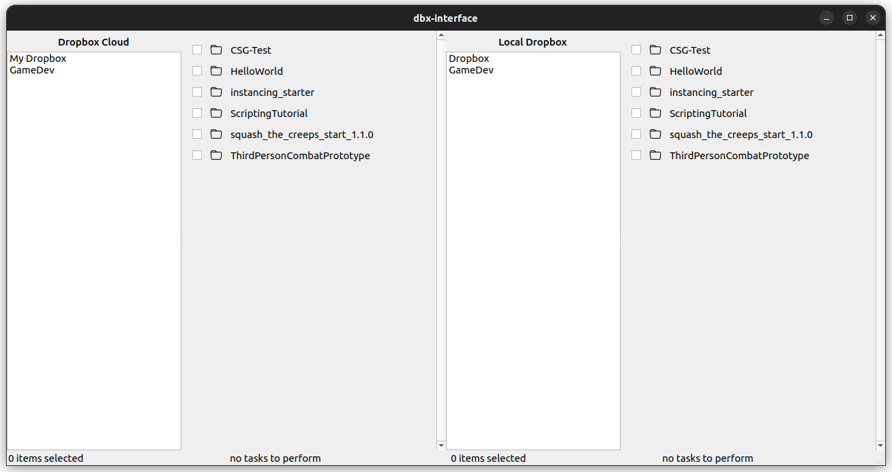
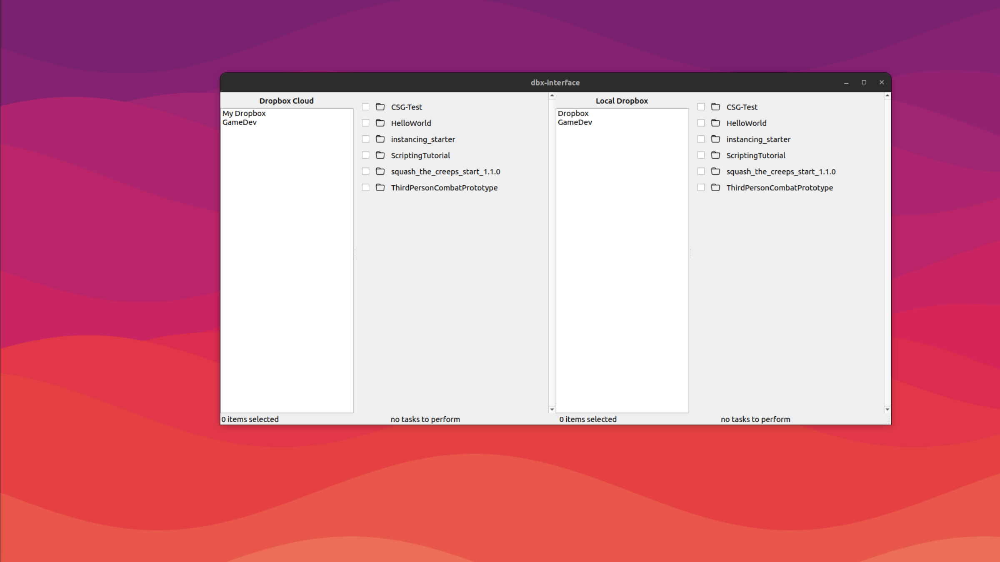

# dbx-interface

    An interface for Dropbox

    

    

## Purpose

The aim for this project is to provide an interface that will allow you to:

* selectively sync
* upload/download
* interact with your Dropbox

Project created due to lack of Smart Sync functionality with Linux

## Installation

1. Clone the repository
2. install requirements with `pip install -r requirements.txt`
3. run `python3 main.py`

## License

This project is under the GNU GPLv3 license.

## Inspired By

Dropbox Uploader
https://github.com/andreafabrizi/Dropbox-Uploader

## Note

No undo/redo function as of yet. Be careful when deleting files and folders.